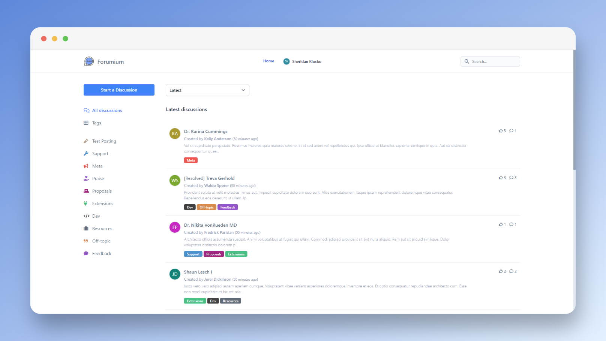

# Forumium

> **Fast**, **Clean**, **Easy** to use and **Open Source** Forum to boost collaboration.

## About Forumium

Forumium is a simple Forum platform made with the [**Laravel Framework**](https://laravel.com) and the elegant TALLkit [**Filament**](https://filamentphp.com/).

It's based on the best technologies to make it **simple**, **fast**, with a **clean UI** and contains almost all the feature you will need to integrate a Forum platform into your company.

## History

First of all, we must mention that the development of the **graphical part**, and thing that gave us the **majority of the development ideas**, was based on the Open Source [Flarum](https://flarum.org/) discussion system.

## Goals

Forumium was designed to respond to this simple goals:

- **Simple to use, Beautiful & Responsive**: Forumium was designed to be the most simple to use to all users and for all types of discussions, the platform was made with [TailwindCSS](https://tailwindcss.com/) and simple [Javascript](https://www.javascript.com/) scripts.
- **For developers**: Forumium was made by developers to developers before all, the platform was made with the [Laravel Framework](https://laravel.com) and the [Filament TALLkit](https://filamentphp.com/) to be the most simple to maintain and improve as needed.
- **Extensible**: As mentioned before, Forumium was made with **Laravel Framework** and **Filament TALLkit** so any *Web Artisan* can work on it to make it BETTER!
- **Open Source**: Forumium is and will be always FREE and Open Source!

## Contribute

As mentioned in the **Goals** section, Forumium is an Open Source project, so it is made and maintained only by the Open Source community. We rely on this community contributions to help us to maintain and improve this awesome platform.

> Check the Github repository for more details about contributions.

